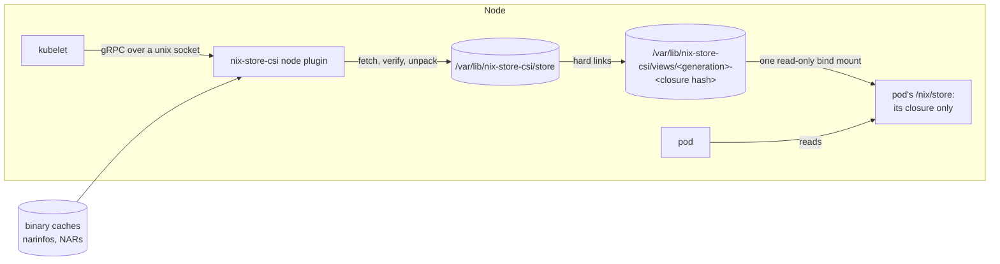

# Architecture

nix-store-csi is a CSI node plugin that mounts Nix store paths in Kubernetes
pods. A pod names store paths in an inline volume mounted at `/nix/store`. The
plugin fetches their closure from binary caches into a store shared by the node.
It then mounts a view that holds that closure and nothing else. The pod's image
needs no `/nix/store` of its own.



## Syncing

A publish goes on once the closure is in `store/`, without waiting for a sync.
Pods read from the page cache, so only losing power can lose such a path, and
that stops the pods too. In the background, the plugin syncs the filesystem
once for all the paths in by then, and renames each narinfo from
`<name>.unsynced` to `<name>.narinfo`. Collection spares a path until its
narinfo has its final name. If a sync fails, the plugin deletes the paths
written before it, since the kernel reports a lost write only once. Views may
link those paths, so it also starts a new generation of views. Publishes from
then on build new views, and pods keep their old ones until they unmount them.

At start-up the plugin compares the boot id with the one it recorded:

- On the same boot, after a restart of the plugin, it syncs and keeps the
  unsynced paths, which mounts may use.
- After a reboot or a failed sync, it deletes them, since they may have lost
  data, and starts a new generation of views.

Either way, it deletes any path in `store/` with no narinfo.

## Collection

Collection deletes the store paths that no mounted view, closure being fetched
or pending sync holds, and that no pod used within `--keep-recent`. It runs
every 10 minutes. While free space or inodes on the state dir's filesystem
fall short of `--ensure-free`, it runs every minute and also deletes recently
used paths, least recently used first, until it frees enough.

## State dir structure

```
<state-dir>/
  lock                      held by the one process using the state dir
  version                   the version of the state dir's layout
  boot-id                   the boot that last used the state dir
  sync-failed               left by a failed sync until the next start-up
  generation                the generation of the views that publishes build
  store/<name>              unpacked store objects, verified
  narinfo/<name>.narinfo    a narinfo per store path, dated by last use, and
                            named <name>.unsynced until the path is synced
  views/<generation>-<closure hash>/
                            a closure, hard-linked from store/
  volumes/<volume>          which view the volume mounts, and where
  tmp/                      store objects being unpacked, views being built,
                            and trash being deleted
```

