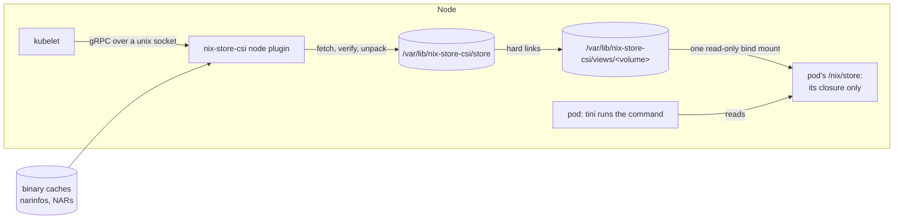

# Architecture

nix-store-csi is a CSI node plugin that puts Nix store paths into Kubernetes
pods without building an image for them. A pod names store paths in an inline
volume mounted at `/nix/store`. The plugin fetches their closure from binary
caches into a store shared by the node. It then mounts a view that holds that
closure and nothing else. The pod's image only needs an empty `/nix/store` to
mount over.



[Harmonia](https://github.com/nix-community/harmonia) parses store paths,
narinfos, signatures and NARs.

## Volumes

Pods declare volumes inline, so the plugin has no controller service.

`NodePublishVolume` reads the volume's space-separated `closures` attribute.
Each entry is a store path, or a path inside one such as the program the pod
runs. It stands for that store path's closure. The plugin makes sure the
closures are in the node store and mounts the view at kubelet's target path.
`NodeUnpublishVolume` unmounts the view and deletes it and the target. kubelet
retries calls, so both are idempotent. Calls for one volume take turns. A
publish that kubelet gave up on keeps running, and an unpublish of its volume
waits for it instead of racing its mount.


The caches and trusted keys come from the plugin's flags, not from the pod.
Pods on a node share the store. A pod that could pick a cache or key could put
its own content under any store path for every pod on the node.

## Resolving

A cache URL is `https://`, `http://` or `file://`. The plugin ignores every
query parameter except `priority`, so URLs copied from Nix's `substituters`
work. User info in the URL becomes HTTP basic auth. Logs and errors leave it
out, since kubelet copies a failed publish's error into the pod's events.

Signatures cover the store dir, so `--store-dir` has to match the caches'. It
defaults to `/nix/store`. The plugin reads each cache's `nix-cache-info` in the
background, so it answers kubelet while a cache is down. It skips a cache it
can't reach, one whose `StoreDir` differs and an HTTP cache with no
`nix-cache-info`, and tries each again every minute. A `file://` cache without
one gets the defaults. A publish that needs a cache waits for every cache's
first try, and names the skipped ones if it can't find a path.

The plugin prefers caches in order of priority, lowest first. A cache's
priority is the URL's `?priority=` if present, else the `Priority` in its
`nix-cache-info`, else 50.

The plugin walks the closure from the roots through each path's references,
with up to 32 paths in flight. A path in the node store needs no request. The
store keeps the narinfo of every path it holds, checked when the path was
fetched, so a restarted plugin publishes what's on the node even while the
caches are down.

For any other path the plugin asks every cache for `<hash>.narinfo` at once, and
takes the path from a cache with a narinfo for it signed by a trusted key. A
better priority always wins, so an answer counts only once every cache with a
better priority has missed. Among caches with the same priority the first to
answer wins, as in ncro, where Nix would go by the order given. Unless the
plugin runs with `--no-require-sigs`, it treats a narinfo without a valid
signature as missing. An error at one cache, like a 401 or a timeout, fails the
lookup only if no other cache has the path. After a failed request the plugin
skips that cache for a minute, as Nix does, so a cache that's down costs one
timeout rather than one per path. If no cache has a path, the publish fails with
an error naming the path and what referenced it.

Nix can compress narinfos on S3, and marks them with `Content-Encoding`, which
the plugin decodes. A publish fails on a narinfo whose `Compression` isn't
`none`, `xz`, `zstd`, `bzip2`, `gzip` or `br`.

## Fetching

The plugin fetches the NARs of missing paths `--max-substitution-jobs` at a
time, 16 by default as in Nix.

It streams each NAR in one pass. It decompresses the body, hashes it with
SHA-256 and unpacks it into its own directory in `tmp/` as it arrives. The
parser rejects entry names that would leave that directory. Only when the NAR's
size and hash match the narinfo's `NarSize` and `NarHash`, which the signature
covers, does the plugin go on. It gives the tree Nix's canonical metadata: mode
0444, or 0555 for directories and executables, and a modification time of 1. It
syncs the tree to disk, writes the narinfo to `narinfo/` and renames the path
into `store/`. So nothing a pod sees comes from a NAR that failed its check.

A narinfo's `URL` is relative to the cache. The plugin keeps a query in it, as
Nix does, since Harmonia puts one there.

The HTTP client retries transient failures for up to a minute, until a response
starts. If the body breaks off after that, the plugin asks for the rest with a
range request. It does so as long as each try gets further, and only while the
server's strong ETag or `Last-Modified` says the file is unchanged. Otherwise
it starts the NAR over, for three attempts in all. If the NAR still fails, or
fails its size or hash check, the plugin tries another cache with a narinfo for
the path, as Nix does. That narinfo has to list the same references, since the
closure came from the first.

kubelet gives up on a call after about two minutes, so a publish waits at most
90 seconds for the closure. If the closure isn't ready by then, the plugin
returns `Unavailable`, saying how much of the closure's NARs has arrived, and
keeps fetching. It logs any error it hits after that. Publishes that need the
same path share one fetch. If it fails, they all get the error, and the next
publish starts a new one.

## The node store

```
<state-dir>/
  lock                      held by the one process using the state dir
  store/<name>              unpacked store paths, verified
  narinfo/<name>.narinfo    their narinfos, dated by their last use
  views/<key>/              a closure, hard-linked from store/
  volumes/<volume>          the key of the volume's view, and its target path
  tmp/                      what's on its way in or out
```

A path enters `store/` by a rename once its NAR is verified and the unpacked
tree is on disk. So every name there is a whole, verified path, and a restarted
plugin reuses them all. At start the plugin deletes `tmp/`, which holds only
unfinished work. Only one process can use a state dir at a time.

Every pod on the node reads the same files, so a path downloads once per node
and pods share its page cache.

The views record what uses the store. Before it serves, and then every 10
minutes, the plugin forgets each volume whose view isn't mounted at its target,
as happens when a node reboots before kubelet unpublishes. It deletes the views
no volume uses. Every 10 minutes it then deletes the store paths that no view
holds and that weren't used for `--gc-after`. That defaults to 24 hours, and
`0s` turns that part off.

It also checks the state dir's filesystem every minute. Above
`--gc-high-threshold`, 85% by default, it deletes more of the paths no view
holds, least recently used first, until their NAR sizes add up to what brings
it down to `--gc-low-threshold`, 80% by default. When that frees nothing, the
next try waits for the 10-minute run. Neither run deletes a path that a publish
is still fetching or mounting.

A path's last use is the modification time of its narinfo. Fetching the path
sets it, and so do a publish that needs the path and deleting a view that holds
it. So a closure stays for `--gc-after` after its last pod goes, however long
that pod ran, and after a reboot too.

The plugin moves a path or a view into `tmp/` before deleting it, so `store/`
and `views/` only ever hold whole ones. A publish marks its closure used before
it fetches anything. It then holds collection off while it builds the view and
mounts it, and an unpublish does while it deletes the view. Neither waits for
a collection's deletes, which happen after it picks what to delete.

## The pod's view

A view holds one entry per path in a closure, and is named by a hash of the
closure's paths. Volumes with the same closure, like the replicas of a
Deployment, share a view. The plugin recreates directories with their
permissions, hard-links files to the node store's copy and copies symlinks,
with the canonical modification time. It builds a view in `tmp/` and renames it
into `views/` when it's whole. `volumes/` records which view each volume
mounts. An unpublish deletes the view once no other volume uses it.

The plugin bind-mounts the view at the target path read-only, nosuid and nodev.
The plugin runs in a container, and mount propagation copies the bind out to
kubelet's mount namespace as it is when it's made. A remount afterwards would
change only the plugin's copy and leave the pod's writable. So the plugin first
binds the view onto itself and remounts that read-only. It then binds the
result at the target and drops the view's own bind. Two publishes of one view
take turns at this. A retried publish keeps a read-only bind of the view that
it finds at the target and replaces anything else.

A volume is one mount however big its closure is. The kernel's `fs.mount-max`
allows 100,000 mounts in a mount namespace. A mount per store path would reach
that at a few dozen pods with large closures. Hard links need `views/` and
`store/` on one filesystem, which is why both live in the state dir.

Views share inodes with the node store. The read-only mount is what keeps a pod
from writing to or changing the mode of files every pod on the node reads. The
container runtime binds the target into the container again, and that bind is
writable unless the volume is read-only. So the plugin refuses a volume without
`readOnly: true`. A view keeps working if its paths leave `store/`, since the
hard links hold the files.

## The runner image

The runner image is scratch with a static tini as its entrypoint, an empty
`/nix/store`, `/tmp`, and these files from nixpkgs' `fakeNss`:
`/etc/passwd` and `/etc/group` with root and nobody, and `/etc/nsswitch.conf`.
They are copies, since the volume hides the store paths that `fakeNss` links
to. A pod passes its command, a program from the closure, as args so tini stays
PID 1. The command then gets default signal handling, and tini reaps orphans.
