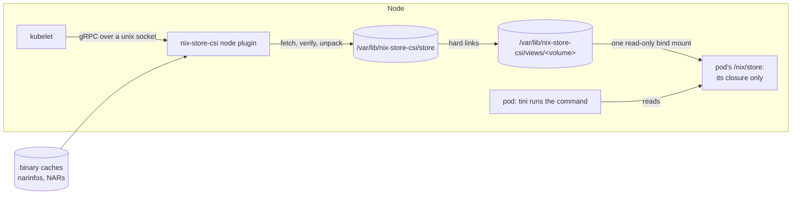
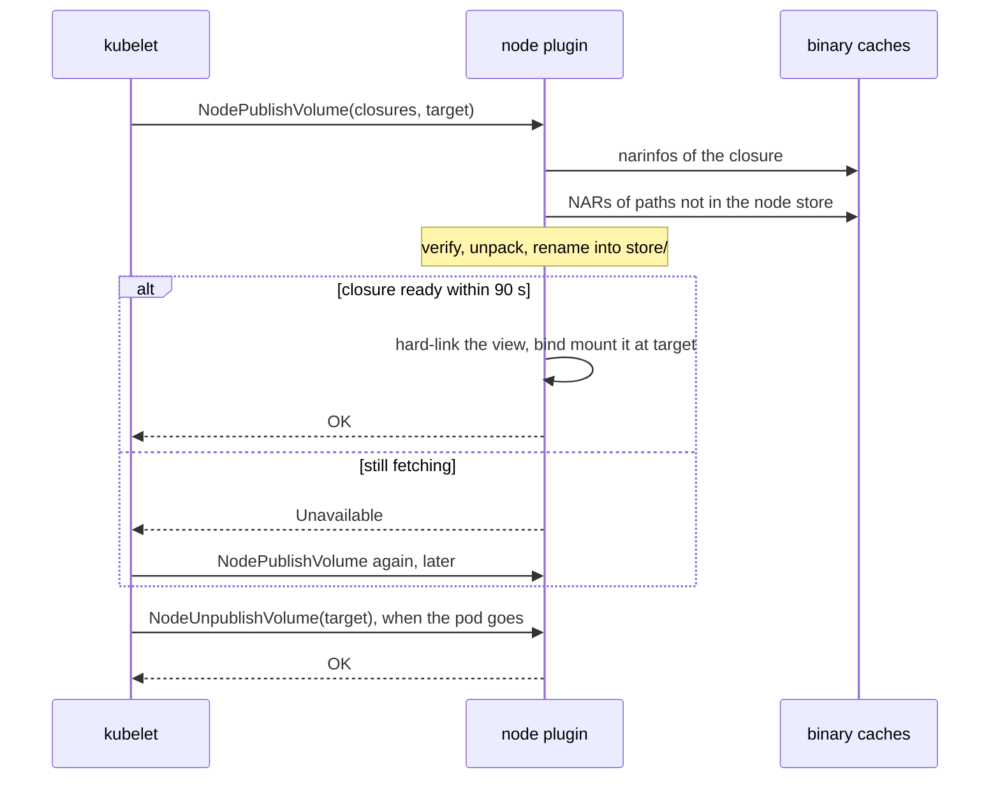

# Architecture

nix-store-csi is a CSI node plugin that puts Nix store paths into Kubernetes
pods without building an image for them. A pod names store paths in an inline
volume mounted at `/nix/store`. The plugin fetches their closure from binary
caches into a store shared by the node. It then mounts a view that holds that
closure and nothing else. The pod's image only needs an empty `/nix/store` to
mount over.



[Harmonia](https://github.com/nix-community/harmonia) parses store paths,
narinfos, signatures and NARs.

## Volumes

Pods declare volumes inline, so the plugin has no controller service.

`NodePublishVolume` reads the volume's space-separated `closures` attribute.
Each entry is a store path, or a path inside one such as the program the pod
runs. It stands for that store path's closure. The plugin makes sure the
closures are in the node store and mounts the view at kubelet's target path.
`NodeUnpublishVolume` unmounts the view and deletes it and the target. kubelet
retries calls, so both are idempotent.



The caches and trusted keys come from the plugin's flags, not from the pod.
Pods on a node share the store. A pod that could pick a cache or key could put
its own content under any store path for every pod on the node.

## Resolving

A cache URL is `https://`, `http://` or `file://`. The plugin ignores every
query parameter except `priority`, so URLs copied from Nix's `substituters`
work.

Signatures cover the store dir, so `--store-dir` has to match the caches'. It
defaults to `/nix/store`. At start the plugin reads each cache's
`nix-cache-info` and refuses a cache whose `StoreDir` differs. It also refuses
an HTTP cache with no `nix-cache-info`. A `file://` cache without one gets the
defaults.

The plugin tries caches in order of priority, lowest first. A cache's priority
is the URL's `?priority=` if present, else the `Priority` in its
`nix-cache-info`, else 50. Caches with equal priority keep the order they were
given in.

The plugin walks the closure by fetching `<hash>.narinfo` for each root and
then for each reference, with up to 32 requests in flight. Each path comes from
the first cache that has a narinfo for it signed by a trusted key. Unless the
plugin runs with `--no-require-sigs`, it treats a narinfo without a valid
signature as missing. If no cache has a path, the publish fails with an error
naming the path and what referenced it. The publish also fails on a narinfo
whose `Compression` isn't `none`, `xz`, `zstd` or `bzip2`.

The plugin keeps the narinfos it finds in memory until their paths leave the
node store. Resolving a closure a second time makes no requests.

## Fetching

The plugin fetches the NARs of missing paths `--max-substitution-jobs` at a
time, 16 by default as in Nix.

It streams each NAR in one pass. It decompresses the body with xz, zstd or
bzip2, hashes it with SHA-256 and writes it to `tmp/<name>.part`. It renames
the file to `tmp/<name>.nar` only when its size and hash match the narinfo's
`NarSize` and `NarHash`, which the signature covers. Only then does it unpack
the NAR, so the NAR parser never sees unverified input.

The HTTP client retries transient failures until a response starts, with up to
a minute of backoff in total. If the body breaks off after that, the plugin
starts the NAR over, for three attempts in all. A NAR that fails its size or
hash check fails the publish at once.

kubelet gives up on a call after about two minutes, so a publish waits at most
90 seconds for the closure. If the closure isn't ready by then, the plugin
returns `Unavailable` and keeps fetching. Publishes that need the same path
share one fetch.

## The node store

```
<state-dir>/
  store/<name>              unpacked store paths, verified
  views/<volume>/store/     a volume's closure, hard-linked from store/
  views/<volume>/target     the volume's target path, for the collector
  tmp/                      NARs, paths and views on their way in, paths on their way out
```

A path enters `store/` by a rename after its NAR is verified and unpacked. So
every name there is a verified path, and a restarted plugin reuses them all. At
start the plugin deletes `tmp/`, which holds only unfinished work.

Every pod on the node reads the same files, so a path downloads once per node
and pods share its page cache.

The views record what uses the store. At start and every 10 minutes the plugin
deletes each view whose target isn't a mount of it, as happens when a node
reboots before kubelet unpublishes. Then it deletes the store paths that no
view holds and that no publish has touched for `--gc-after`. That defaults to
24 hours, and `0s` turns collection off. A publish sets the modification time
of each path it mounts, which records when the path was last used.

The plugin moves a path into `tmp/` before deleting it, so a name in `store/`
still means a whole path. Publishes and unpublishes don't run while a
collection picks paths and moves them out. So a collection can't take a path
between a publish's fetch and its mount, or a view that an unpublish is
deleting. Neither waits for the deletes that follow.

## The pod's view

Each volume gets its own view, named by kubelet's volume ID. It holds one entry
per path in the closure. The plugin recreates directories with their
permissions, hard-links files to the node store's copy and copies symlinks. It
builds the view in `tmp/` and renames it into `views/` when it's whole, so a
retried publish reuses a view it finds there.

The plugin bind-mounts the view at the target path read-only, nosuid and nodev.
The plugin runs in a container, and mount propagation copies the bind out to
kubelet's mount namespace as it is when it's made. A remount afterwards would
change only the plugin's copy and leave the pod's writable. So the plugin first
binds the view onto itself and remounts that read-only. It then binds the
result at the target and drops the view's own bind. A retried publish keeps a
read-only bind of the view that it finds at the target and replaces anything
else.

A volume is one mount however big its closure is. The kernel's `fs.mount-max`
allows 100,000 mounts in a mount namespace. A mount per store path would reach
that at a few dozen pods with large closures. Hard links need `views/` and
`store/` on one filesystem, which is why both live in the state dir.

Views share inodes with the node store. The read-only mount is what keeps a pod
from writing to or changing the mode of files every pod on the node reads. A
view keeps working if its paths leave `store/`, since the hard links hold the
files.

## The runner image

The runner image is scratch with a static tini as its entrypoint, an empty
`/nix/store`, `/tmp`, and these files from nixpkgs' `fakeNss`:
`/etc/passwd` and `/etc/group` with root and nobody, and `/etc/nsswitch.conf`.
They are copies, since the volume hides the store paths that `fakeNss` links
to. A pod passes its command, a program from the closure, as args so tini stays
PID 1. The command then gets default signal handling, and tini reaps orphans.
